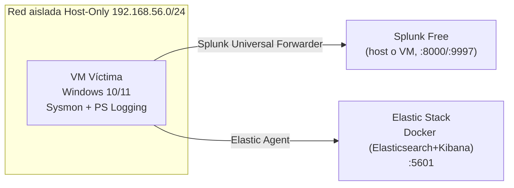

# DetectionForge — Laboratorio Operativo (Fase 1)

Diseñado para correr en una sola laptop (probado como referencia sobre un
equipo tipo Legion 5, Core Ultra 7, 16–32 GB RAM). Si el equipo tiene 16 GB,
no levantes Splunk y el stack de Elastic al mismo tiempo — ver nota en §5.

## 1. Topología



La red host-only **no tiene salida a internet ni a tu red doméstica**: así,
cualquier prueba de emulación (Atomic Red Team) queda contenida.

## 2. Requisitos

- Hipervisor: VirtualBox (gratis) o VMware Workstation Player.
- Docker Desktop (para el stack de Elastic).
- ISO de evaluación de Windows 10/11 (Microsoft ofrece versiones de evaluación
  de 90 días gratuitas para desarrolladores/estudiantes).
- Cuenta gratuita de Splunk (para la licencia Free/Developer).

## 3. Paso 1 — Red aislada en VirtualBox

```bash
VBoxManage hostonlyif create
VBoxManage hostonlyif ipconfig vboxnet0 --ip 192.168.56.1 --netmask 255.255.255.0
```

Al crear la VM Windows, su adaptador de red debe apuntar a **Host-only
Adapter → vboxnet0**, no a NAT ni Bridged.

## 4. Paso 2 — VM víctima Windows

1. Crear VM: 2 vCPU, 4 GB RAM, 60 GB disco, red host-only (§3).
2. Instalar Windows, activar RDP o usar la consola de VirtualBox.
3. Instalar **Sysmon** con la configuración de SwiftOnSecurity:

```powershell
Invoke-WebRequest -Uri "https://download.sysinternals.com/files/Sysmon.zip" -OutFile "Sysmon.zip"
Expand-Archive Sysmon.zip -DestinationPath Sysmon
Invoke-WebRequest -Uri "https://raw.githubusercontent.com/SwiftOnSecurity/sysmon-config/master/sysmonconfig-export.xml" -OutFile sysmonconfig.xml
.\Sysmon\Sysmon64.exe -accepteula -i sysmonconfig.xml
```

4. Habilitar logging de PowerShell (necesario para el ejemplo de regla T1059.001):

```powershell
$path = "HKLM:\SOFTWARE\Policies\Microsoft\Windows\PowerShell\ScriptBlockLogging"
New-Item -Path $path -Force
Set-ItemProperty -Path $path -Name "EnableScriptBlockLogging" -Value 1
```

## 5. Paso 3 — Splunk Free

1. Descargar Splunk Enterprise (la licencia se convierte a Free tras 60 días,
   o se selecciona Free directamente en el registro) e instalar en el host
   o en una VM Linux ligera dentro de la misma red host-only.
2. Habilitar el puerto de recepción para forwarders:

```bash
/opt/splunk/bin/splunk enable listen 9997 -auth admin:changeme
```

3. En la VM víctima, instalar el **Universal Forwarder** apuntando a la IP
   del host-only de Splunk (puerto 9997) y configurar el input de Sysmon
   (canal `Microsoft-Windows-Sysmon/Operational`) y de PowerShell
   (`Microsoft-Windows-PowerShell/Operational`).

> Nota de recursos: si tu equipo tiene 16 GB de RAM, corre Splunk *o* el
> stack de Elastic a la vez, no ambos — la VM Windows (4 GB) + uno de los
> dos (3–4 GB) + el host (4 GB) ya usa la mayoría de la memoria disponible.
> Con 32 GB puedes tener los dos activos simultáneamente sin problema.

## 6. Paso 4 — Elastic Security (Docker)

```yaml
# docker-compose.yml (colocar en docs/lab/ o donde prefieras, fuera de rules/)
version: "2.2"
services:
  es01:
    image: docker.elastic.co/elasticsearch/elasticsearch:8.15.0
    environment:
      - discovery.type=single-node
      - xpack.security.enabled=true
      - ELASTIC_PASSWORD=changeme
    ports:
      - "9200:9200"
    mem_limit: 2g
  kibana:
    image: docker.elastic.co/kibana/kibana:8.15.0
    environment:
      - ELASTICSEARCH_HOSTS=http://es01:9200
      - ELASTICSEARCH_USERNAME=elastic
      - ELASTICSEARCH_PASSWORD=changeme
    ports:
      - "5601:5601"
    depends_on:
      - es01
    mem_limit: 1g
```

```bash
docker compose up -d
```

En la VM víctima, instala **Elastic Agent** con la integración de Windows
(desde Kibana → Fleet), apuntando a `http://<ip-host-only-del-host>:8220`.

## 7. Paso 5 — Verificar ingesta

- **Splunk**: `index=main sourcetype=XmlWinEventLog:Sysmon` debe mostrar eventos.
- **Elastic**: en Kibana → Discover, el data view `logs-windows.*` debe mostrar
  los mismos eventos de Sysmon/PowerShell.

Si ambos muestran eventos frescos al generar actividad en la VM (por ejemplo,
ejecutar cualquier comando de PowerShell), el laboratorio está operativo.

## 8. Fase 2 (pendiente) — Microsoft Sentinel

Requiere una suscripción de Azure. La ruta recomendada para estudiantes es
**Azure for Students** (crédito sin tarjeta de crédito). No se declara este
SIEM como "en alcance" hasta confirmar el acceso y validar la ingesta de al
menos un evento de prueba.

## 9. Seguridad del laboratorio

- La red host-only nunca debe tener una regla de NAT hacia internet.
- No usar credenciales reales del trainee/SecureSoft en ningún componente del laboratorio.
- Las contraseñas de este documento (`changeme`) son solo para el entorno local; cámbialas si el laboratorio queda accesible por más personas del equipo.
